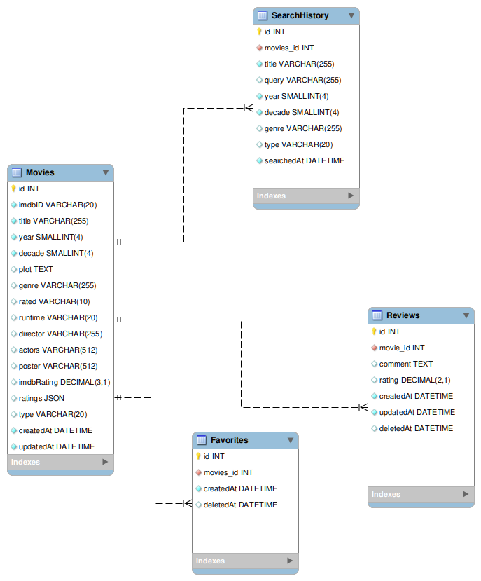

# 🎬 dtiFlix — Arquitetura do Projeto

Aplicação **Full Stack** desenvolvida para simular uma plataforma de filmes, com recursos de busca via **OMDb API**, histórico de pesquisa, favoritos, avaliações e estatísticas em um painel interativo.

---

## 🧱 Visão Geral da Arquitetura

A arquitetura do **dtiFlix** é dividida em dois módulos principais:

| Camada                | Tecnologias                                               | Descrição                                                                                                    |
| --------------------- | --------------------------------------------------------- | ------------------------------------------------------------------------------------------------------------ |
| **Frontend (client)** | Next.js, React, TypeScript, TailwindCSS, React Query, MUI | Responsável pela interface do usuário (UI), exibindo filmes, estatísticas e interagindo com a API via Axios. |
| **Backend (server)**  | Node.js, Express, Sequelize, PostgreSQL, Redis            | Exposição de rotas RESTful, integração com a OMDb API, cache sob demanda e persistência dos dados.           |

---

## ⚙️ Fluxo de Dados

1. O **usuário** pesquisa um filme na interface.
2. O **frontend (Next.js)** faz a requisição à API backend (`/movies/search/:imdbID/:queryTerm`).
3. O **backend (Express)**:
   * Verifica se o filme existe no **Redis Cache**. -> (Resposta imediata)
   * Se não existir, busca no **banco local (PostgreSQL)**. -> (Resposta quase imediata) 
   * Caso ainda não exista, chama a **OMDb API** e salva o resultado. -> (Resposta demorada/longa)
   * O resultado é armazenado no **Redis Cache**. -> (Processamento adicional necessário)
   * Estrategia de **Soft Delete** para preservar o histórico de buscas e favoritos -> (Garantindo integridade).
4. O resultado é retornado e exibido no **carrossel de filmes** do frontend.
5. As ações do usuário (favoritar, avaliar, buscar) são registradas em tabelas específicas (`Favorites`, `Reviews`, `SearchHistory`).

---

## 🗃️ Modelo Entidade-Relacionamento (ER)


### Entidades Principais

| Entidade          | Descrição                                        |
| ----------------- | ------------------------------------------------ |
| **Movies**        | Armazena os dados dos filmes vindos da OMDb API. |
| **Favorites**     | Representa filmes favoritados pelo usuário.      |
| **Reviews**       | Contém comentários e avaliações dos filmes.      |
| **SearchHistory** | Guarda histórico de pesquisas realizadas.        |

### Características Técnicas

* **Soft Delete**: `deletedAt` preserva registros excluídos sem perdê-los definitivamente.
* **Cache sob Demanda**: Redis armazena temporariamente resultados de busca.
* **Denormalização**: Atributos redundantes (como `genre`, `year`, `decade`) facilitam análises e consultas no dashboard.

## 📖 Diagrama Pé de Galinha


---

## 🧩 Estrutura de Pastas

### **Backend**

```
src/
 ├── controllers/         # Lógica de entrada e saída das rotas
 ├── db/                  # Configuração do banco de dados
 ├── models/              # Modelos Sequelize (ORM)
 ├── routes/              # Rotas Express documentadas com Swagger
 ├── services/            # Regras de negócio (ex: MovieService, FavoriteService)
 ├── utils/               # Utilitários (ApiError, redisClient, etc.)
 ├── middlewares/         # Validações (Zod, filtros via sqlFilter (biblioteca), autenticação futura)
 ├── docs/                # Configuração Swagger JSDoc
 ├─ app.js                # Configuração Express
 └─ server.js             # Inicialização da API
 ├─ .env                  # Variáveis de ambiente
 ├─ .env.example          # Exemplo de variáveis de ambiente
 ├─ .squelizerc           # Configuração do Sequelize
 └─ docker-compose.yml    # Configuração Docker (PostgreSQL, Redis)
 ```

### **Frontend**

```
src/
 ├── app/                 # Páginas e layouts do Next.js
   └─ _components/        # Componentes privados reutilizáveis (UI) 
 ├── components/          # Componentes reutilizáveis (UI de libs)
 ├── services/            # Axios services (movies, favorites, reviews, dashboard)
 ├── hooks/               # Custom hooks
 ├── @types/              # Tipos TypeScript globais
 └── utils/               # Helpers gerais (trataImage.util.ts)
```

---

## 🚀 Tecnologias e Ferramentas

### **Backend**

* Node.js + Express
* Axios
* Sequelize (ORM)
* PostgreSQL
* Redis (cache sob demanda)
* Zod (validação de dados)
* Swagger (documentação da API)
* Nodemon, ESLint, Prettier

### **Frontend**

* Next.js (v15 com Turbopack)
* TypeScript
* TailwindCSS
* React Query
* Magic UI
* Origin Ui
* Material UI (MUI)
* Axios

---

## 🔄 Comunicação Front ↔ Back

* Todas as requisições do frontend passam pelos services em `/src/services/`.
* As rotas seguem o padrão REST:

  * `GET api/movies` → listar filmes
  * `GET api/movies/search/:imdbID/:queryTerm` → buscar via OMDb
  * `POST api/favorites` → adicionar aos favoritos
  * `GET api/dashboard/review-media` → métricas do painel
  

---

## 🧠 Principais Conceitos

* **Cache sob demanda**: evita chamadas desnecessárias à API externa.
* **Soft delete**: mantém integridade e histórico de favoritos e avaliações.
* **Denormalização estratégica**: melhora a performance de consultas para o dashboard.
* **Camada de serviço (Service Layer)**: garante separação entre regra de negócio e acesso a dados.
* **Swagger**: fornece documentação automática das rotas.

---

## 📊 Dashboard

O painel mostra:

* Quantidade de buscas e avaliações.
* Médias de notas (`review-media`).
* Gêneros e décadas mais populares.
* Distribuição de anos dos filmes buscados.
* Distribuição das decadas dos filmes buscados.

---

## 🧪 Execução Local

### 🐘 Iniciar banco PostgreSQL via Docker

```bash
docker compose up
```

### ▶️ Iniciar backend

```bash
cd backend
npm install
npm run dev
```

### 💻 Iniciar frontend

```bash
cd frontend
npm install
npm run dev
```

---

## 🧾 Documentação da API

Acesse no navegador:

```
http://localhost:3000/api-docs
```

---

## 👨‍💻 Autor

📍 **Davi Cândido de Almeida** -
Desenvolvedor Full Stack
🔗 [GitHub](https://github.com/DaviKandido)
