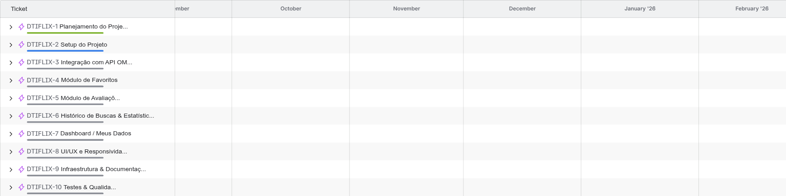

# 🗂️ Planejamento e Documentação do Projeto

## 📋 Visão Geral

O planejamento do **dtiFlix** foi estruturado para garantir **organização, rastreabilidade e qualidade em todas as etapas do desenvolvimento**, desde a definição de escopo até a entrega final.
As práticas utilizadas priorizaram **transparência, controle de versão e metodologias ágeis**, permitindo o avanço contínuo e a documentação clara de cada decisão técnica.

---

## 🧭 Metodologia de Desenvolvimento

O desenvolvimento foi conduzido seguindo os princípios do **Scrum** e a organização visual de tarefas pelo **Kanban**, com o auxílio do **Jira Software**.

### 🔹 Etapas principais:

1. **Planejamento inicial** – definição do escopo, objetivos e tecnologias.
2. **Modelagem e arquitetura** – criação do modelo entidade-relacionamento (ER) e definição da arquitetura MVC.
3. **Setup do ambiente** – configuração de backend, frontend e containers Docker.
4. **Implementação modular** – desenvolvimento de cada módulo de forma independente e documentada.
5. **Integração e testes** – conexão entre frontend e backend, validação de fluxo completo.
6. **Entrega e documentação final** – escrita das documentações complementares e testes de qualidade.

---

## 🧱 Organização e Ferramentas

| Categoria                    | Ferramenta / Estratégia                   | Descrição                                                                                                                                      |
| ---------------------------- | ----------------------------------------- | ---------------------------------------------------------------------------------------------------------------------------------------------- |
| **Gerenciamento de Tarefas** | **Jira Software (Kanban)**                | As tarefas foram organizadas em colunas: “Pendentes”, “Em andamento”, “Em análise” e “Concluídas”, garantindo visualização clara do progresso. |
| **Controle de Versão**       | **Git + GitHub**                          | O versionamento seguiu o modelo **GitFlow**, com branches `main`, `develop` e `feature/*`.                                                     |
| **Commits Semânticos**       | `feat`, `fix`, `refactor`, `docs`, `test` | Cada commit segue um padrão semântico, permitindo rastreabilidade clara das mudanças.                                                          |
| **Metodologia Ágil**         | **Scrum + Kanban**                        | Aplicação de ciclos curtos de desenvolvimento e refinamento contínuo de tarefas.                                                               |
| **Documentação Técnica**     | **Markdown + Swagger**                    | A documentação foi centralizada em arquivos Markdown e complementada pela documentação da API via Swagger.                                     |
| **Modelagem de Dados**       | **MySQL Workbench + Diagrama ER**         | A estrutura do banco foi desenhada graficamente e depois migrada para PostgreSQL com Sequelize.                                                |
| **Infraestrutura**           | **Docker + PostgreSQL + Redis**           | Contêineres configurados para isolar o ambiente de desenvolvimento e cache sob demanda.                                                        |

---

## 🗂️ Organização das Tasks no Jira

As tarefas foram organizadas e rastreadas no **Jira**, com tags por módulo e prioridade.
Os principais epics e categorias criados foram:

| Epic / Categoria            | Descrição                                                                  |
| --------------------------- | -------------------------------------------------------------------------- |
| **Planejamento do Projeto** | Definição de escopo, roadmap, tecnologias e cronograma inicial.            |
| **Setup do Projeto**        | Configuração de ambiente de backend, frontend, banco e containers.         |
| **Integração com OMDb API** | Implementação da busca de filmes e cache sob demanda.                      |
| **Módulo de Favoritos**     | CRUD completo com soft delete e persistência de dados.                     |
| **Módulo de Avaliações**    | Sistema de notas e comentários com cálculo de médias.                      |
| **Dashboard**               | Exibição de estatísticas analíticas de uso (gêneros, décadas, avaliações). |
| **UI/UX Responsividade**    | Telas responsivas, carrosséis e design inspirado no estilo Apple.          |
| **Testes e Qualidade**      | Testes de integração, validação de schema e tratamento de erros.           |

📊 As tarefas foram exportadas do Jira e podem ser consultadas no arquivo:
[`Documentacao/Tarefas_Jira.csv`](../Documentacao/Tarefas_Jira.csv)

📊 Ou visualizadas em:
[`Documentacao/EtapasJira.png`](../Documentacao/EtapasJira.png)



---

## 🧩 Modelagem e Arquitetura

### 📘 Modelo Entidade-Relacionamento (ER)

O modelo ER define as entidades centrais (**Movies**, **Favorites**, **Reviews** e **SearchHistory**) e suas relações de 1:N.
O foco foi na **normalização com desnormalizações estratégicas** para otimizar consultas analíticas no dashboard.

🖼️ Diagrama completo:
[`Documentacao/dtiFlix-ER_Model.jpg`](../Documentacao/dtiFlix-ER_Model.jpg)

### 🧠 Estrutura de Pastas

```bash
dtiflix/
├── backend/
│   ├── src/
│   │   ├── controllers/
│   │   ├── models/
│   │   ├── routes/
│   │   ├── services/
│   │   ├── middlewares/
│   │   ├── utils/
│   │   └── server.js
│   └── swagger/
├── frontend/
│   ├── src/app/
│   ├── components/
│   ├── services/
│   ├── hooks/
│   └── styles/
└── Documentacao/
    ├── Setup_do_Projeto.md
    ├── Infraestrutura_Documentacao.md
    ├── Planejamento_e_Documentacao.md
    └── ...
```

---

## 🔄 Fluxo de Trabalho (GitFlow)

O fluxo GitFlow foi adotado para garantir controle e previsibilidade durante o desenvolvimento:

```bash
main       → versão estável e pronta para produção
develop    → branch principal de desenvolvimento
feature/*  → novas funcionalidades isoladas
fix/*      → correções de bugs
docs/*     → atualizações de documentação
```

Exemplo de commits semânticos:

```bash
feat: add movie search endpoint with OMDb integration
fix: correct rating calculation on reviews
docs: add setup guide and architecture documentation
```

---

## 🧪 Testes e Validação

Os testes seguiram dois eixos principais:

1. **Validação de entrada de dados** com **Zod**.
2. **Testes de integração e rotas REST** utilizando o Postman e Swagger UI.

Além disso, o projeto passou por **validações de ESLint + Prettier**, garantindo padronização e consistência de código em todos os módulos.

---

## 📅 Exemplo de Cronograma de Desenvolvimento

| Etapa                                     | Duração Estimada | Status          |
| ----------------------------------------- | ---------------- | --------------- |
| Planejamento e Setup                      | 1 dias           | ✅ Concluído    |
| Implementação Backend (API + DB)          | 2 dias           | ✅ Concluído    |
| Implementação Frontend (UI + Integrações) | 2 dias           | 🚧 Em andamento |
| Documentação e testes finais              | 1 dia            | 🕐 Em andamento |

---

## 🧾 Conclusão

O planejamento e controle do dtiFlix garantiram uma execução organizada, com rastreabilidade completa das decisões técnicas.
O uso de **Jira, GitHub, Scrum e GitFlow** possibilitou **entregas incrementais e documentação sólida**, permitindo fácil manutenção e evolução futura do projeto.
